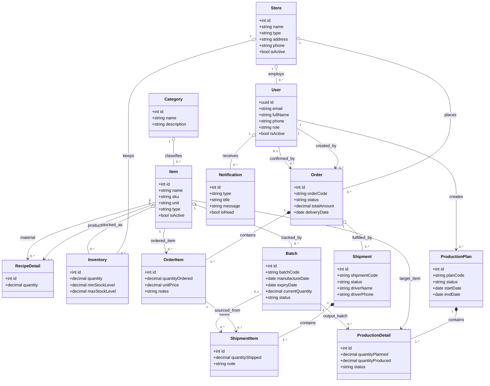
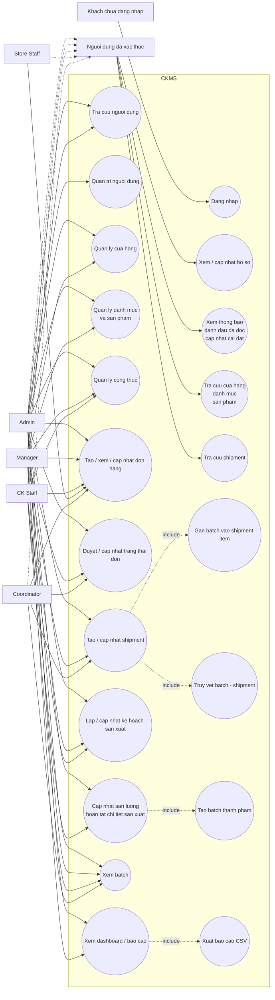

# CKMS Class Diagram và Use Case Diagram

Tài liệu này tổng hợp sơ đồ lớp và sơ đồ use case của hệ thống CKMS dựa trên schema Supabase, shared types và các API controller hiện có trong repo.

## 1. Class Diagram

## 2. Use Case Diagram

## 3. Nguon doi chieu

- Database schema: `supabase/migrations/20260117000001_initial_schema.sql`
- Shared types: `packages/types/src/*.ts`
- API controllers: `apps/api/src/*/*.controller.ts`
- Frontend routes: `apps/web/src/app/dashboard/layout.tsx`, `apps/web/src/app/login/page.tsx`

## 4. Ghi chu

- Diagram duoc ve o muc nghiep vu he thong, khong di sau vao cac class framework nhu controller, service, guard.
- Trong code hien tai co mot cho dung ten role cu `supply_coordinator` trong module production, trong khi schema va enum dang dung `coordinator`.
- Mermaid "use case" duoc bieu dien bang `flowchart` de de render tren GitHub va cac markdown viewer pho bien.
